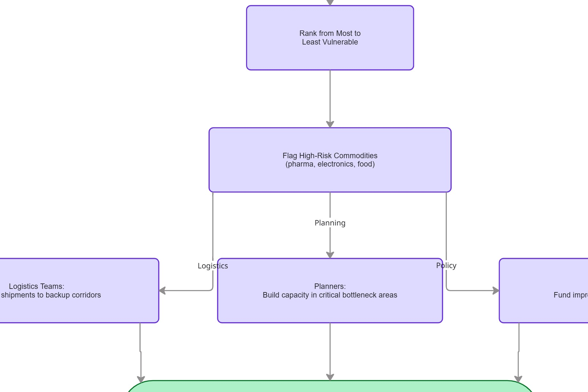
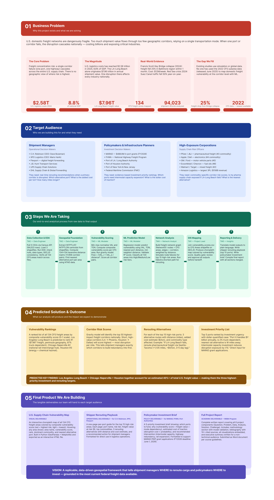
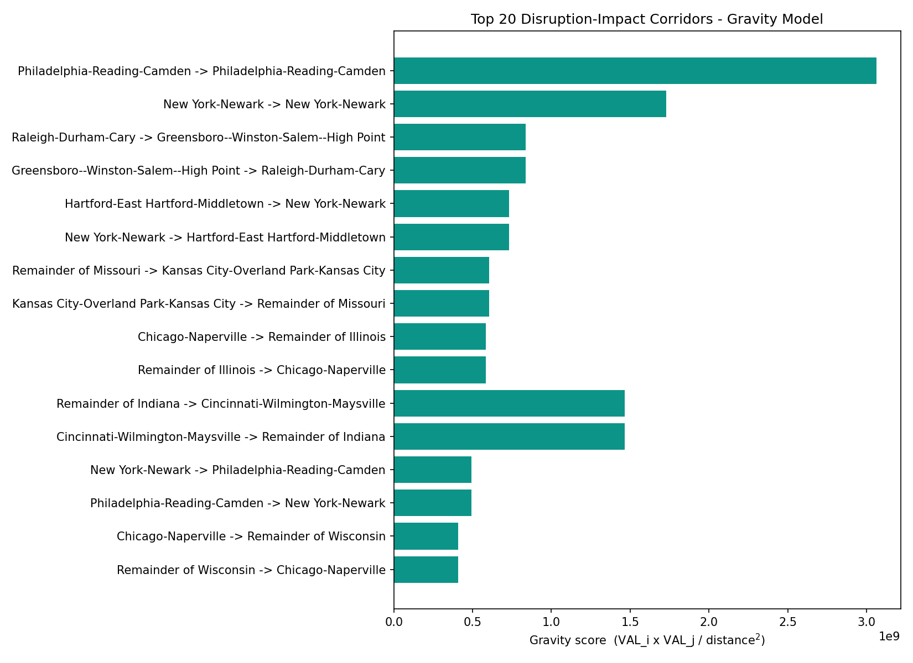

# 🚢 ClearPath Analytics

**Ranking all 134 U.S. freight corridors by disruption risk — from the federal Commodity Flow Survey to a live, interactive risk explorer.**

> The highest-vulnerability corridor is **not** the most dangerous one to lose. ClearPath separates raw freight concentration from **network position** — and finds that **Dallas–Fort Worth, only #4 by vulnerability score, produces the single worst rerouting outcome in the country.**

**🔗 [Live Dashboard](https://shreya2622-clearpath-analytics-dashboard-shreya-ijktnu.streamlit.app/) · [Figma Project Brief](https://www.figma.com/board/6TWkFvmcqvBU3bpHF4cLHF/Supply-Chain-Vulnerability-%E2%80%94-Project-Brief?node-id=0-1) · [Full Case Study](https://sarrangtech.github.io/clearpath)**

`Geospatial ML · Network Analysis · Federal Data · Business Analytics Capstone (MISM 6214)`

---

## 📊 Headline Numbers

| Metric | Value |
|---|---|
| **Random Forest LOOCV accuracy** | **90.3%** across all 134 areas |
| **National freight value analyzed** | **$18.04T** (within 8% of the BTS benchmark) |
| **Worst-case rerouting cost** | **$5.28T** — Dallas–Fort Worth failure |
| **CFS areas ranked** | **134** |
| **Corridor pairs modeled** | **17,822** directed pairs |
| **Raw shipment records ingested** | **94,023** |

---

## Table of Contents

1. [The Problem](#1-the-problem)
2. [Target Audience](#2-target-audience)
3. [How the Team Framed It — Miro & Figma](#3-how-the-team-framed-it)
4. [Data Pipeline](#4-data-pipeline)
5. [The Centroid Bug](#5-the-centroid-bug--a-74-data-quality-failure-caught-and-fixed)
6. [Vulnerability Scoring](#6-vulnerability-scoring)
7. [Machine Learning — Random Forest](#7-machine-learning--random-forest-classifier)
8. [Gravity Model](#8-gravity-model)
9. [Network Simulation — The Counterintuitive Finding](#9-network-simulation--the-counterintuitive-finding)
10. [Rerouting Playbook](#10-rerouting-playbook)
11. [Hidden Risk: Memphis](#11-hidden-risk-memphis)
12. [Key EDA Findings](#12-key-eda-findings)
13. [Automated Monitoring](#13-automated-monitoring--weekly-github-actions-digest)
14. [The Dashboard](#14-the-dashboard--nine-screens-across-six-tabs)
15. [Challenges & Resolutions](#15-challenges--resolutions)
16. [Recommendations](#16-recommendations)
17. [Tech Stack](#17-tech-stack)
18. [Repository Structure](#18-repository-structure)
19. [How to Run](#19-how-to-run)
20. [Data Sources & References](#20-data-sources--references)

---

## 1. The Problem

U.S. domestic freight networks are **dangerously fragile**. Too much shipment value flows through too few geographic corridors, often relying on a single transportation mode. When one port or corridor fails, the disruption cascades nationally — costing billions and exposing critical industries.

The **2024 Francis Scott Key Bridge collapse** made this concrete: a single piece of infrastructure failed, regional freight dropped **25% within one month**, and delay-related costs ran at an estimated **$12M per week**. Baltimore is not even a top-5 freight corridor by value — yet the disruption required a coordinated federal and state response.

| Stat | Value | Meaning |
|---|---|---|
| U.S. logistics costs (2024) | **$2.58T** | 8.8% of GDP — well above the pre-pandemic 7.4–7.8% range |
| LA–Long Beach freight value | **$7.96T** | A single corridor; one disruption there affects every industry |
| CFS freight zones mapped | **134** | The geographic resolution the 2022 CFS now enables |
| Shipment records analyzed | **94,023** | Primary CFS API analysis layer |
| Bridge-collapse freight drop | **25%** | Regional, within one month |
| CFS data vintage | **2022** | Newest available subarea data |

**The gap we fill:** existing studies use simulation or global data. No publicly available tool had used the 2022 CFS subarea data to map **domestic** freight vulnerability at the **corridor level with ML**. ClearPath Analytics is that tool.

---

## 2. Target Audience

ClearPath is built for three decision-makers who currently lack a ranked, geographically explicit vulnerability index:

| Audience | Who | What they need |
|---|---|---|
| **Shipment Managers** | C.H. Robinson, J.B. Hunt, XPO, Flexport, UPS, DHL | Real-time rerouting recommendations when a primary corridor is disrupted — which alternative, what added cost/ton, how many extra miles |
| **Policymakers & Infrastructure Planners** | MARAD, FHWA, Port of LA/Long Beach, Port of Houston, FMC | Evidence-based investment priority rankings — which corridors to fund, and the dollar cost of inaction (FY2026 PIDP grants: $488.6M) |
| **High-Exposure Corporations** | Pharma (Pfizer, J&J), electronics (Apple, Dell), autos (GM, Ford), retail (Walmart, Target) | Commodity-specific corridor risk scores — *"Is my pharma supply chain exposed if LA–Long Beach fails? What's the nearest alternative?"* |

---

## 3. How the Team Framed It

Before any data was touched, the team mapped the entire causal chain — from disruption to economic consequence — so the analysis stayed anchored to **actionable outputs** rather than interesting-but-unusable findings.

### Miro Process Map

`START → estimate freight value per area → freight flows through the 134 CFS areas`, then a fork: a **risk-cascade** lane (concentration → allocation strain → reduced capacity → shipment delays → inventory shortages → rising logistics costs → supply-chain vulnerability) and an **analytics** lane (2022 CFS data → aggregate → normalize value/tonnage → score → rank → flag high-risk commodities). Both converge on **"which areas require action?"** → logistics teams reroute, planners build capacity, policymakers fund improvements.



### Figma Project Brief

The five-part brief: **Business Problem → Target Audience → Steps We Are Taking → Predicted Solution & Outcome → Final Product**.



---

## 4. Data Pipeline

All primary data originated from two federal agencies: the **U.S. Census Bureau's 2022 Commodity Flow Survey (CFS) API** and the **Bureau of Transportation Statistics (BTS) TIGER/Line** shapefile repository. The four CFS datasets were retrieved programmatically via paginated API calls (**94,023 rows**), validated against published CFS cross-tabulation totals.

> ⚠️ **Security note:** an early version of the extraction script had a Census API key hardcoded in source. It was caught during code review, **regenerated, and replaced with a `CENSUS_API_KEY` environment variable** before the repo was made public.

```
Census CFS API (94,023 rows)
      → Centroids (INTPTLAT/INTPTLON from shapefile)
      → Distance Matrix (17,822 Haversine corridor pairs)
      → Port Proximity (NTAD intermodal facilities)
      → Features Master (21-column ML-ready table)
      → Vulnerability Scores (134 CFS areas ranked)
```

| Dataset | Source | Rows | Description |
|---|---|---|---|
| `cfs_freight_area.csv` | Census CFS API | 94,023 | Freight value + tonnage by CFS area and commodity code |
| `cfs_exports.csv` | Census CFS API | 102 | Export flows by origin state and commodity |
| `cfs_hazmat.csv` | Census CFS API | 48 | Hazmat freight — high-risk corridors needing specialized routing |
| `cfs_temp_controlled.csv` | Census CFS API | 308 | Cold-chain freight — food/pharma vulnerability |
| `centroids.csv` | BTS TIGER/Line shapefile | 134 | Census INTPTLAT/INTPTLON per CFS area (post-bug-fix) |
| `distance_matrix.csv` | Team-computed | 17,822 | Haversine distances for all 134×133 directed corridor pairs |
| `features_master.csv` | Team-engineered | 134 | 21-column ML-ready feature table; zero nulls |
| `vulnerability_scores.csv` | Team-computed | 134 | Composite vulnerability index for all 134 areas |

---

## 5. The Centroid Bug — A 74% Data-Quality Failure, Caught and Fixed

During gravity-model construction, a significant upstream error surfaced. The original `centroids.csv` had been geocoded **by area name** rather than by shapefile coordinates — collapsing **66 of 134 areas onto incorrect coordinates**:

- Buffalo, Rochester, Albany → all placed on **New York City's** lat/lon
- Baltimore, MD → placed in **Columbia, SC**
- San Diego, Fresno, Sacramento → all on a single generic California point

This produced **118 zero-distance corridors** and silently wrong distances on **13,266 of 17,822 corridors (74%)**.

**The fix:** read `INTPTLAT`/`INTPTLON` directly from `2022_CFS_Areas.shp` (joined on `GEO_ID` = `CFS22_GE_1`) — a guaranteed-inside, authoritative Census coordinate — and recompute all distances with Haversine. **Zero zero-distance corridors** remain. All four derived geo files were rebuilt and backed up as `*.orig.csv`.

The Spearman rank correlation between original and corrected vulnerability scores was **ρ = 0.978** — the geographic story held, but absolute distances and rerouting costs were only valid *after* the fix.

> **A second data-quality issue** was caught separately: the original scores summed freight values across all three SCTG commodity hierarchy levels (2-, 3-, and 4-digit), **triple-counting** most shipments and inflating the national total to **$112T**. The corrected pipeline uses only the `COMM=0` aggregate row per area → **$18.04T**, within 8% of the BTS-published benchmark of $19.6T.

---

## 6. Vulnerability Scoring

Each of the 134 CFS areas receives a composite score:

```
vuln = (val_norm × 0.60) + (ton_norm × 0.40)
```

Shipment **value** carries 60% weight because high-value freight (pharmaceuticals, electronics, motor vehicles) generates disproportionate economic disruption per unit of volume. **Tonnage** carries 40% to capture bulk-freight corridors where infrastructure stress is highest even at lower per-unit value.

**Robustness:** the index was run at 60/40, 50/50, and 40/60 weightings — all yield **Spearman ρ ≥ 0.99**, and 9 of the top 10 corridors are identical across all weightings. The rankings are robust to the weighting choice.

| Rank | CFS Area | Freight Value | Vuln. Score | Tier |
|---:|---|---:|---:|---|
| 1 | Los Angeles–Long Beach, CA | $7,963.8B | 0.882 | High |
| 2 | Houston–The Woodlands, TX | $4,234.6B | 0.719 | High |
| 3 | Chicago–Naperville, IL-IN-WI | $4,290.3B | 0.521 | High |
| 4 | Dallas–Fort Worth, TX-OK | $3,757.1B | 0.500 | High |
| 5 | Remainder of Texas | $2,166.3B | 0.434 | High |
| 7 | Remainder of Pennsylvania | $2,254.8B | 0.345 | High |
| 14 | Seattle–Tacoma, WA | $2,123.7B | 0.243 | High |
| 70 | Memphis–Forrest City, TN-MS-AR | $862.5B | 0.085 | Low ⚠️ |

**Tiers** (percentile-based): High (top 10%), Medium (75th–90th), Low (below 75th) → **14 High, 20 Medium, 100 Low**. Gini coefficient for freight value = **0.461** (concentration is real but not extreme); **66 areas** are needed to cover 80% of national freight value.

---

## 7. Machine Learning — Random Forest Classifier

With only **134 rows**, a standard 80/20 split would leave ~27-sample test sets — statistically unreliable. Instead, **Leave-One-Out Cross-Validation (LOOCV)** is used: each area serves as its own test case exactly once. The classifier uses `class_weight='balanced'` to compensate for the 100:20:14 Low:Medium:High imbalance.

**Result: 90.3% LOOCV accuracy.**

### Feature Importance

| Feature | Importance |
|---|---:|
| Tonnage | **0.326** |
| Value | **0.285** |
| Num Commodities | 0.187 |
| Val/Ton Ratio | 0.076 |
| Seaport Distance | 0.065 |
| Neighbor Distance | 0.042 |
| Is Metro | 0.019 |
| Dominant Commodity | **0.000** |

> **Dominant commodity type contributes exactly zero predictive importance.** It's *how much* freight moves through a corridor — not *what kind* — that determines its vulnerability tier. This directly contradicts the intuition that pharma or electronics corridors are inherently more vulnerable than bulk-commodity corridors.

### Classification Report

| Tier | Precision | Recall | F1 | Support |
|---|---:|---:|---:|---:|
| High | 0.80 | 0.86 | 0.83 | 14 |
| Medium | 0.73 | 0.55 | 0.63 | 20 |
| Low | 0.94 | 0.98 | 0.96 | 100 |
| **Overall** | **0.90** | **0.90** | **0.90** | **134** |

The lower Medium-tier recall (0.55) reflects genuine ambiguity at the middle tier. Two High-tier areas (Remainder of Kentucky, Seattle–Tacoma) were predicted Medium; their scores (0.2452, 0.2427) sit just above the 90th-percentile cutoff — genuine borderline cases, not misclassifications.

> Notebook: [`To be submitted/10_Risk_Tier_Classifier_RF.ipynb`](To%20be%20submitted/10_Risk_Tier_Classifier_RF.ipynb)

---

## 8. Gravity Model

A spatial gravity model scores all **17,822 directed corridor pairs**:

```
gravity_ij = (VAL_i × VAL_j) / distance_ij²
```

High-gravity corridors move the most freight value over the shortest distance, so a disruption there propagates the largest economic shock. The `gravity_norm` (0–1) column serves directly as the **edge weight** in the NetworkX graph.

The **Philadelphia–Reading–Camden** corridor emerged as the highest-gravity nationally — specifically between the PA and NJ state parts, separated by just **16.96 miles**. The extremely short distance combined with high freight value at both endpoints produced a gravity score nearly **twice** that of the next-ranked corridor (New York–Newark NJ ↔ NY, 60 mi). This correctly surfaces dense, short-haul intra-metro flows as the highest-impact disruption scenarios.

> Script: [`scripts/gravity_model.py`](scripts/gravity_model.py) · Output: `supply_chain_data/03_outputs/corridor_gravity_scores.csv` (17,822 ranked rows)



---

## 9. Network Simulation — The Counterintuitive Finding

A **K=8 nearest-neighbor NetworkX graph** was built (134 areas as nodes, Haversine distance as edge weights). Each of the 14 High-tier areas was simulated as a failure (node removal), then **Dijkstra shortest-path** found every origin-destination pair whose route was affected. Rerouting cost:

```
cost ($) = extra_miles × (node_TON × 1,000 short tons) × $0.08/ton-mile   (BTS standard truck rate)
```

**The most important finding: Dallas–Fort Worth ranks only #4 by vulnerability score but produces the single worst rerouting outcome** — because of its structural **network centrality**. LA–Long Beach is #1 by score but only 4th-worst by rerouting cost, because the K=8 topology offers multiple coastal bypass routes.

| CFS Area | Vuln. Rank | Rerouting Cost | OD Pairs | Extra Miles |
|---|---:|---:|---:|---:|
| **Dallas–Fort Worth, TX-OK** | **#4** | **$5,284.78B** | **484** | **32,954** |
| Remainder of Pennsylvania | #7 | $3,977.46B | 1,028 | 30,695 |
| Remainder of Illinois | #6 | $3,282.03B | 426 | 19,144 |
| Los Angeles–Long Beach | #1 | $1,487.95B | 109 | 7,151 |
| Chicago–Naperville | #3 | $1,279.99B | 314 | 8,759 |
| Houston–The Woodlands | #2 | — (resilient) | 0 | — |
| Seattle–Tacoma | #14 | — (resilient) | 0 | — |

> **Houston scores #2 by vulnerability but produces zero rerouting cost** — the K=8 network absorbs its failure entirely. A lower-connectivity K=4 topology would surface Houston's fragility. The network topology assumption is itself a design choice that shapes the conclusions — documented as a known limitation and Phase 2 extension.

> Script: [`To be submitted/09_network_rerouting.py`](To%20be%20submitted/09_network_rerouting.py) · Output: `failure_simulation_results.csv`, `To be submitted/05_rerouting_detail.csv`

---

## 10. Rerouting Playbook

Alternative corridors pre-identified for the five highest-cost failure scenarios:

| If This Corridor Fails | Primary Reroute Path | Avg. Added Miles | Affected OD Pairs |
|---|---|---:|---:|
| **Dallas–Fort Worth, TX-OK** | Remainder of Texas → Remainder of Oklahoma | 68.1 mi | 484 |
| Remainder of Pennsylvania | Philadelphia-Reading-Camden → Pittsburgh-New Castle-Weirton | 29.9 mi | 1,028 |
| Remainder of Illinois | Chicago-Naperville → Remainder of Indiana | 44.9 mi | 426 |
| Los Angeles–Long Beach, CA | San Jose-SF-Oakland → San Diego-Chula Vista-Carlsbad | 65.6 mi | 109 |
| Chicago–Naperville, IL-IN-WI | Remainder of Illinois → Remainder of Wisconsin | 27.9 mi | 314 |

For areas embedded in dense metro clusters, average added distance per shipment is **under 45 miles** — nearby alternatives absorb rerouted volume without large detours. For areas that are the primary node in a larger region (DFW, LA–Long Beach), it jumps to **65–68 miles** — there's no equally positioned alternative nearby.

---

## 11. Hidden Risk: Memphis

Memphis–Forrest City ranks **#70 of 134** by overall vulnerability score (0.0847) — firmly Low tier. A policymaker scanning the ranked table would have no reason to flag it. Yet commodity-level EDA revealed it handles **4.5% of national pharmaceutical freight value** — **third nationally**, behind only LA–Long Beach (11.5%) and Chicago (6.3%) — because the **FedEx SuperHub** routes overnight pharmaceutical distribution through Memphis.

This is a mismatch between aggregate vulnerability (Low) and **commodity-specific concentration risk** (Top 3). A general-purpose ranking built on total VAL and TON will always miss this. Because the risk is driven by a single carrier's hub-and-spoke architecture rather than geography, the correct mitigation is **carrier-specific**: maintain a secondary overnight carrier (UPS, DHL) for time-sensitive pharmaceutical shipments.

> This illustrates why commodity-specific concentration analysis at the SCTG-4 grain — layered on top of geographic scores — surfaces hidden risks aggregate rankings miss. A systematic SCTG-4 scan across all 134 areas is the natural Phase 2 extension.

---

## 12. Key EDA Findings

1. **Freight concentration is broader than the LA–Long Beach headline.** Gini = 0.461; top 5 areas hold only 17.5% of national value; 66 areas needed to cover 80%. → Target the top **30–40** corridors, not just the top 5 ports.
2. **Bug corrected; vulnerability ranking preserved.** SCTG triple-count inflated the national total by 3.42×. After correction: $18.04T, within 8% of the BTS benchmark. Spearman ρ = 0.978.
3. **Census suppression affects 45.91% of commodity rows.** `VAL=0` is intentional Census suppression of small/confidential cells, not missing data. All commodity analysis uses SCTG-2 as canonical grain; SCTG-4 reserved for the Memphis case study.
4. **Pharmaceutical concentration centers on Memphis, not the Northeast.** Top 5: LA–Long Beach (11.5%), Chicago (6.3%), Memphis (4.5%), DFW (4.2%), Boston (3.9%). Memphis is #3 because of the FedEx SuperHub — not manufacturing.
5. **Remainder-of-State zones are a distinct bulk-freight risk class.** Non-metro Remainder zones carry **42.9% of national tonnage** despite only 29.1% of value. Four of the top 10 vulnerability areas are Remainder zones — a structurally different risk profile requiring separate policy response.

---

## 13. Automated Monitoring — Weekly GitHub Actions Digest

[`digest_runner.py`](digest_runner.py) monitors BTS freight indicators for the top 15 CFS areas and sends email alerts when any area's weekly volume drops **≥15% below its 4-week rolling average**. It runs **serverless on GitHub Actions** via a weekly cron schedule — no infrastructure required.

```
Weekly cron (Mon 12:00 UTC) → pull live BTS indicators → compare vs 4-week rolling avg → email alert if drop ≥15% → log to digest_log.csv
```

In its first live run against real BTS data, it correctly flagged a **74.1% week-over-week drop** in the New York–Newark corridor — exactly the early signal that turns a 72-hour reactive scramble into a 4-hour execution of a pre-approved plan.

> Workflow: [`.github/workflows/weekly_digest.yml`](.github/workflows/weekly_digest.yml) — also supports `workflow_dispatch` with a `--demo` mode (injects a synthetic disruption). Email via SendGrid (`SENDGRID_API_KEY` / `FROM_EMAIL` repo secrets).

---

## 14. The Dashboard — Nine Screens Across Six Tabs

**🔗 [Open the live Streamlit dashboard →](https://shreya2622-clearpath-analytics-dashboard-shreya-ijktnu.streamlit.app/)**

Built with Python · Streamlit · GeoPandas · Plotly · NetworkX.

### Overview
*Vulnerability score by area & risk-tier distribution — all 134 CFS areas ranked, with the High / Medium / Low split.*


### Network Map
*K=8 nearest-neighbour graph, each area linked to its eight neighbours and colored by risk tier.*


### Failure Simulation — Aggregate
*Node-removal run across all 14 High-tier areas, totalling ~$17T in rerouting cost.*


### Failure Simulation — Score vs Cost
*The headline chart: vulnerability score vs rerouting cost — network position beats raw score.*


### Failure Simulation — Rerouting Impact Map
*Origin-destination paths that reroute when Dallas–Fort Worth, the worst-case node, fails.*


### Gravity Corridors
*Top 100 corridors drawn on the map, line thickness ∝ gravity score.*


### Area Deep-Dive — Profile
*Per-area drilldown — risk tier, freight value, and tonnage for any selected CFS area.*


### Area Deep-Dive — Neighbours & Ports
*The selected area's eight graph neighbours and its distance to the nearest intermodal port.*


### Commodity Risk
*422 SCTG categories — flagging $2.1T of hazmat and $3T of temperature-controlled freight.*


---

## 15. Challenges & Resolutions

| Challenge | Impact | Resolution |
|---|---|---|
| Centroid geocoding bug | 74% of corridor distances corrupted (13,266 / 17,822) | Read INTPTLAT/INTPTLON from shapefile via GEO_ID join; rebuilt all derived geo files |
| SCTG triple-counting | National total inflated to $112T (actual $18.04T) | Use only the `COMM=0` aggregate row per area; validated vs BTS benchmark |
| API key in source code | Census key hardcoded & committed | Key regenerated; replaced with `CENSUS_API_KEY` env var before going public |
| Census suppression (45.91% of rows) | Commodity drilldowns unreliable below SCTG-2 | SCTG-2 as canonical grain; SCTG-4 only for Memphis (high volume, low suppression) |
| 134-row dataset | 80/20 split → ~27-sample test sets, unreliable | Leave-One-Out Cross-Validation |
| K=8 topology masks fragility | Houston & Seattle show zero rerouting cost | Documented as a limitation; K=4 analysis flagged as Phase 2 |

---

## 16. Recommendations

**Shipment Managers** — Pre-negotiate backup carrier capacity on **Dallas–Fort Worth first** (worst simulated outcome despite only #4 vulnerability rank). Treat Memphis as a named pharmaceutical contingency. Subscribe to the weekly digest for 72-hour early warning.

**Policymakers** — Prioritize the **14 High-tier areas** for investment review — DFW, Remainder of Pennsylvania, and Remainder of Illinois first. Broaden the lens beyond the 5 largest port cities. Treat rural Remainder-of-State zones as a separate investment category.

**Implementation** — No new infrastructure required to begin. The weekly digest is live on GitHub Actions; the rerouting playbook and investment brief are generated directly from `corridor_gravity_scores.csv`, `risk_tier_output.csv`, and `failure_simulation_results.csv`.

---

## 17. Tech Stack

`Python` · `Pandas` · `GeoPandas` · `NetworkX` · `scikit-learn` · `Random Forest` · `Haversine` · `Census CFS API` · `BTS TIGER/Line` · `Dijkstra Shortest Path` · `GitHub Actions` · `SendGrid` · `Plotly` · `Streamlit` · `Figma FigJam` · `Miro` · `LOOCV` · `Gravity Model` · `Spearman Correlation`

---

## 18. Repository Structure

```
ClearPath-Analytics/
├── .github/workflows/
│   └── weekly_digest.yml              # serverless weekly freight-drop digest (cron + manual)
├── assets/screenshots/                # dashboard screens, Miro map, Figma brief
├── scripts/
│   ├── README.md                      # gravity-model pipeline + centroid-bug writeup
│   ├── rebuild_centroids.py           # 1. fix coordinates + distance matrix
│   ├── rebuild_features.py            # 2. fix geo-derived feature columns
│   └── gravity_model.py               # 3. score + rank all 17,822 corridors
├── supply_chain_data/
│   ├── 01_api_data/                   # 4 raw CFS API pulls (freight, exports, hazmat, temp)
│   ├── 02_shapefiles/                 # TIGER/Line county + 2022 CFS areas shapefiles
│   ├── 03_outputs/                    # gravity scores, vulnerability scores, charts
│   ├── 04_references/                 # literature + bibliography
│   ├── 05_features/                   # centroids, distance matrix, features master (+ .orig backups)
│   ├── Supply_Chain_Data_Dictionary.docx
│   └── data_inventory.txt             # provenance + centroid-bug correction log
├── To be submitted/                   # final deliverable bundle (corrected CSVs, scripts, RF notebook, charts)
│   ├── 01_vulnerability_scores_corrected.csv
│   ├── 02_risk_tier_output.csv
│   ├── 03_corridor_gravity_scores.csv
│   ├── 04_failure_simulation_results.csv
│   ├── 05_rerouting_detail.csv
│   ├── 06–08_*.py                     # rebuild + gravity scripts
│   ├── 09_network_rerouting.py        # K=8 graph + Dijkstra failure simulation
│   ├── 10_Risk_Tier_Classifier_RF.ipynb
│   └── 11_digest_runner.py
├── digest_runner.py                   # weekly monitoring job
├── failure_simulation_results.csv
├── vulnerability_scores.csv
└── subscribers.csv                    # digest recipients
```

---

## 19. How to Run

### Rebuild the geospatial pipeline

```bash
pip install pyshp            # plus pandas, numpy, matplotlib

python scripts/rebuild_centroids.py   # 1. fix coordinates + distance matrix
python scripts/rebuild_features.py    # 2. fix geo-derived feature columns
python scripts/gravity_model.py       # 3. score + rank corridors
```

Each script is **idempotent** and backs up any file it overwrites to `*.orig.csv` (only on first run, so backups always hold the original pre-fix data).

### Run the weekly digest locally

```bash
pip install pandas numpy
export SENDGRID_API_KEY=...   # optional — omit to dry-run
export FROM_EMAIL=...
python digest_runner.py            # live mode
python digest_runner.py --demo     # inject a synthetic disruption for demos
```

### Network failure simulation & RF classifier

See [`To be submitted/09_network_rerouting.py`](To%20be%20submitted/09_network_rerouting.py) (K=8 graph + Dijkstra) and [`To be submitted/10_Risk_Tier_Classifier_RF.ipynb`](To%20be%20submitted/10_Risk_Tier_Classifier_RF.ipynb) (LOOCV Random Forest).

---

## 20. Data Sources & References

- **U.S. Census Bureau — 2022 Commodity Flow Survey (CFS) API** — freight value & tonnage by CFS area and SCTG commodity code
- **Bureau of Transportation Statistics — TIGER/Line 2022** — county boundaries + 2022 CFS Areas shapefile (134 freight zones)
- **NTAD** — intermodal port/terminal facility locations
- **BTS** — $0.08/ton-mile standard truck freight rate; national freight benchmark ($19.6T)
- Literature on intermodal disruption resilience, geographic concentration risk, and the 2025 State of Logistics — see [`supply_chain_data/04_references/bibliography.txt`](supply_chain_data/04_references/bibliography.txt)

---

<sub>Built as the MISM 6214 Business Analytics capstone. Dashboard screenshots and the Miro/Figma artifacts are captured from the live project environment. Code and corrected datasets are in this repository.</sub>
